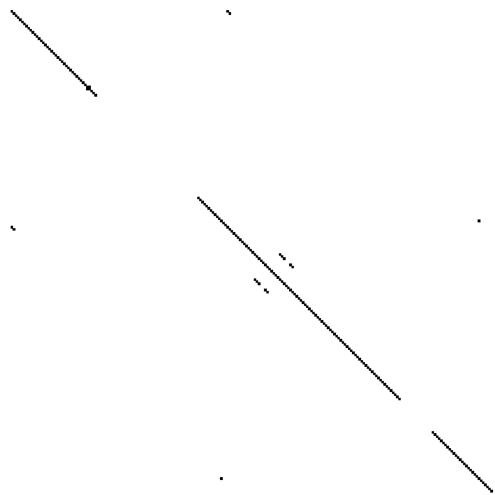

# Repeat sequence utilities (reputils)

Inspired by the TE workshop recently (run by Alex Suh). Designed to be used on files downstream of RepeatModeler2/RepeatMasker2. Might have some utility beyond this.

## Usage

Everything is pretty much printed to stdout or to a PNG.

```
reputils 0.1.3
Max Brown <mb39@sanger.ac.uk>
reputils - some functions to aid TE discovery.

USAGE:
    reputils [SUBCOMMAND]

FLAGS:
    -h, --help       Prints help information
    -V, --version    Prints version information

SUBCOMMANDS:
    con     Make a consensus out of a multiple alignment fasta. Optimised for TE's.
    div     Calculate diversity along sliding windows of an alignment.
    help    Prints this message or the help of the given subcommand(s)
    tir     Take a consensus and quickly check for terminal inverted repeats (TIR)
    ttc     Trim an alignment to the core TE sequence.
```

### Make a consensus

```
reputils-con 
Make a consensus out of a multiple alignment fasta. Optimised for TE's.

USAGE:
    reputils con [FLAGS] [OPTIONS] --fasta <fasta>

FLAGS:
    -a, --append     Append the consensus to the input fasta.
    -h, --help       Prints help information
    -V, --version    Prints version information

OPTIONS:
    -f, --fasta <fasta>    The multiple alignment file in fasta format.
    -n, --name <name>      Name of the consensus sequence header. [default: CONS]
```

### Diversity in windows over a TE alignment

It's more clear when the alignment is trimmed to include only the putative TE.

```
reputils-div 
Calculate diversity along sliding windows of an alignment.

USAGE:
    reputils div [FLAGS] --fasta <fasta> --step <step> --window <window>

FLAGS:
    -h, --help       Prints help information
    -p, --plot       Plot the diversity across windows of the alignment. Output is a PNG.
    -V, --version    Prints version information

OPTIONS:
    -f, --fasta <fasta>      The consensus sequence file in fasta format.
    -s, --step <step>        The step size of the window to iterate over. If equal to window, then windows are non-
                             overlapping. [default: 25]
    -w, --window <window>    The size of the window to iterate over. [default: 25]
```

### Presence of TIR's

Quickly check whether your consensus sequence has TIR's.

```
reputils-tir 
Take a consensus and quickly check for terminal inverted repeats (TIR)

USAGE:
    reputils tir [FLAGS] --fasta <fasta>

FLAGS:
    -h, --help       Prints help information
    -s, --show       Pretty print the alignment.
    -V, --version    Prints version information

OPTIONS:
    -f, --fasta <fasta>    The consensus sequence file in fasta format.
```

### Trim alignment to core TE sequence

This script will take an alignment and trim it to the TE, plus any TSD's (hopefully). It needs a bit of testing, but worked on the Mariners I was looking at. TE's with 5' truncation may not work with this.

```
reputils-ttc 
Trim an alignment to the core TE sequence.

USAGE:
    reputils ttc --extend <extend> --fasta <fasta>

FLAGS:
    -h, --help       Prints help information
    -V, --version    Prints version information

OPTIONS:
    -e, --extend <extend>    Extend the extracted alignment by `e` many bases either side of the alignment. [default:
                             10]
    -f, --fasta <fasta>      The multiple alignment sequence file in fasta format.
```

### Help to identify TSD's

Looks at the either end of a *trimmed* alignment (must be trimmed). I don't know how useful this actually is (it might confuse things more). But here it is:

```
reputils-tsd 
Try to find the Target Site Duplication of a TE. Prints a table.

USAGE:
    reputils tsd --fasta <fasta> --length <length> --maximum <maximum> --minimum <minimum>

FLAGS:
    -h, --help       Prints help information
    -V, --version    Prints version information

OPTIONS:
    -f, --fasta <fasta>        The multiple alignment sequence file in fasta format.
    -l, --length <length>      Number of bases from beginning and end of alignment to query. [default: 20]
    -x, --maximum <maximum>    TSD's are searched for <= to this length. [default: 12]
    -m, --minimum <minimum>    TSD's are searched for >= to this length. [default: 2]

```

### Dotplot of sequences

Takes a fasta file and self compares each sequence.

```
reputils-dot 
Make (self) dotplots from a fasta file. Suitable really only for short(ish) sequences.

USAGE:
    reputils dot --dir <dir> --fasta <fasta> --nmatches <nmatches> --wsize <wsize> --wstep <wstep>

FLAGS:
    -h, --help       Prints help information
    -V, --version    Prints version information

OPTIONS:
    -d, --dir <dir>              Dirname where output plots should go. [default: dot]
    -f, --fasta <fasta>          The multiple alignment sequence file in fasta format.
    -n, --nmatches <nmatches>    Number of matches to tolerate a positive match. [default: 1]
    -i, --wsize <wsize>          Window size to iterate over sequence. [default: 10]
    -t, --wstep <wstep>          Window step size for window iterator. [default: 4]
```



TODO list:
- simple fasta stats of consensus sequences, sequence length, and length distribution (if multiple fastas)?
- Detect 5' truncation?